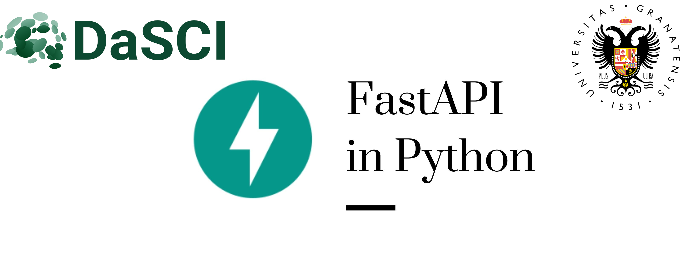
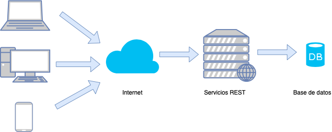
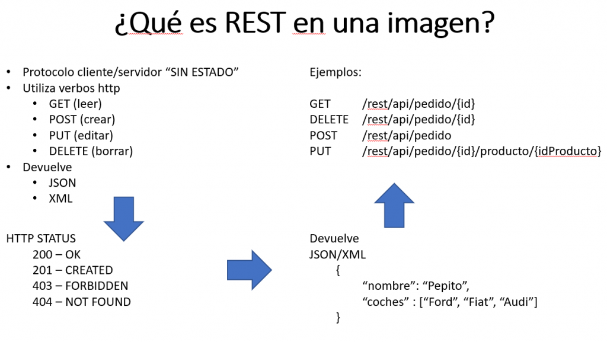
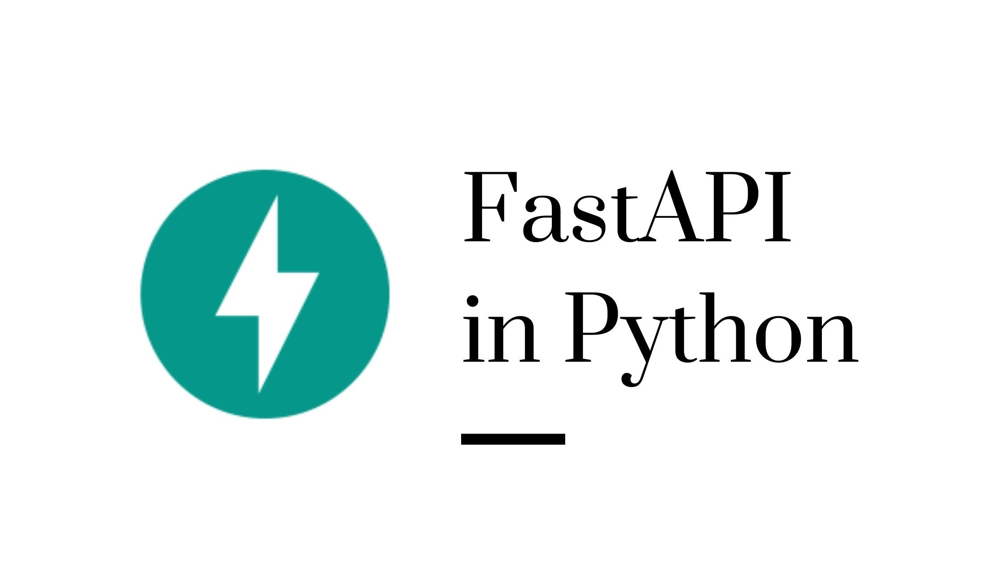
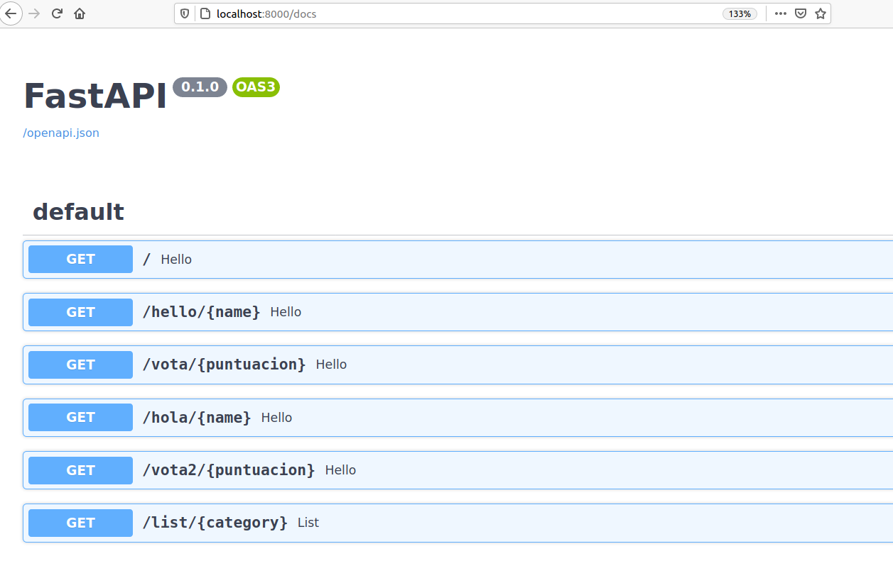
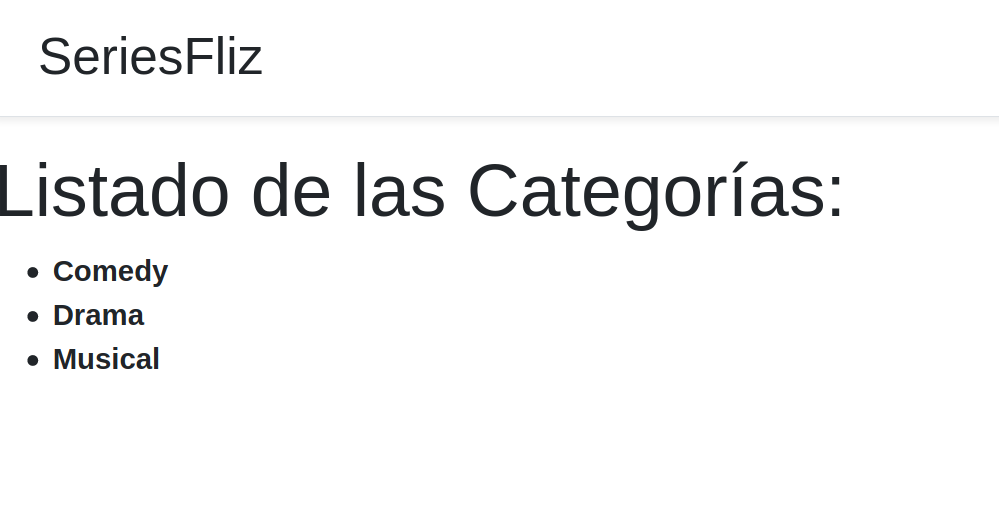
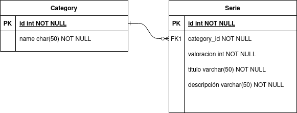

## Servicios REST con
</img><br>

<center>Por: Daniel Molina Cabrera<br>
[http://www.danimolina.net](http://www.danimolina.net)
</center>

---

## ¿Quién soy yo?

<ul style="margin=300px">
<li>Profesor Titular de Informática de la UGR.</li>
<li>Experto en Inteligencia Artificial.</li>
<li>Desarrollador/Usuario de Python durante más de 10 años.</li></ul>


---

## ¿Quién soy yo?

<ul style="margin=300px">
<li> Partidario convencido del Software Libre.</li>
<li> <i>Linuxero</i> convencido, y usuario de Emacs.</li>
<li> Gran fan de Python.</li>
</ul>
</img>

# Servicios REST

## ¿Qué son servicios REST?



---

## ¿Qué son servicios REST?



---


## Ventajas de los servicios REST

- Distinto lenguaje de <i>frontend</i> y de <i>backend</i>.

- Fácil y cómodo.

- Modelo multi-servicios.

- Cada vez más usados con frameworks JS.

# FastAPI

## ¿Qué es FastAPI?

</img><br>

- Librería en <strong>Python</strong> para servicios <strong>REST</strong>.

- Fácil de usar, y centrada en lo usado.

---

## ¿Qué es Python?

Lenguaje de programación

de <span class="fragment visible highlight-blue">propósito general</span> y
<span class="fragment visible highlight-red">fácil de aprender</span>.

---

## ¿Por qué es popular?

Es muy sencillo y legible

```python
msg = "Hola a todos"
print(msg)
print(msg.replace("os", "as"))

for name in ["Amalia", "Arturo"]:
    print(f"a {name} también")
```
---

## Es muy potente

- Repositorio centralizado de librerías. 
- Librerías para casi todo.


---

##  Usado en *Machine Learning*

- Lenguaje muy usado en *Machine Learning*.


- Se diseñó para integrarlas con sistemas webs.


# demo de FastAPI

---

### Muy Sencillo

```python
from fastapi import FastAPI

app = FastAPI()

@app.get("/")
def hello():
    return {"msg": "Hola a todo el  mundo"}
```

---

## Ejecutándolo

```sh
unicorn test:app --reload
ó
hypercorn test:app --reload
```

---

## Documentación

</img>

---

### Lectura de parámetros

```python
@app.get("/hello/{name}")
def  hello(name):
    return {"msg": f"Hola, {name}"}
```

---

### Parámetros

```python
@app.get("/list/{category}")
def list(category, page=0):
    return {"series": f"series from category {category}, from page {page}"}
```

---

### Validación automática

```python
@app.get("/vota/{puntuacion}")
def  hello(puntuacion: int):
    return {"resultado": f"Sumo {puntuacion}"}
```

<!-- --- -->

<!-- ### Opciones de Validación -->

<!-- ```python -->
<!-- @app.get("/hola/{name}") -->
<!-- def  hello(name: str = Path("desconocido", min_length=5)): -->
<!--     return {"msg": f"Hola, {name}"} -->
<!-- ``` -->

<!-- ```python -->
<!-- @app.get("/vota/{puntuacion}") -->
<!-- # gt implies greater than -->
<!-- # le implies less or equals to -->
<!-- def hello(puntuacion: int,  Path(0, gt=0, le=10)): -->
<!--    return {"resultado": f"Sumo {puntuacion}"} -->
<!-- ``` -->

# Servicio REST de Series

---

## Servicio REST de Series

- Acceso a Base de Datos de datos sobre series de streaming.

- Servicio REST sobre dichos datos.

- Validación de datos.

---

## Página web

- Usaremos Bootstrap v5 como framework CSS.

- Usaremos Vue como frontend.

- Se ejecuta JS en el cliente.

- Compondremos la web a partir de los servicios REST.

---

## Caso 1: Consulta de Categorías

### Servicio REST (demo

```python
@app.get("/categories")
def hello():
    return {"categories": [{'id': 0, 'text': "Comedy"}, {'id': 1, 'text': "Drama"}, {'id': 2, 'text': 'Musical'}]}
```

---

### HTML

```html
            <div id="app">
                <h1>Listado de las Categorías:</h1>
                <ul>
             <li v-for="category in categories" :key="category.id">
                 <strong>{{category.text}}</strong>
             </li>
                </ul>
            </div>
```

---

### Javascript

```javascript
app = new Vue({
    el: '#app',
    created() {
        this.fetchData();
    },
    data: {
        categories: []
    },
    methods: {
        fetchData() {
            axios.get('http://localhost:8000/categories').then(response => {
                this.categories = response.data.categories;
            });
        }
    }
});
```

---

## Resultado

</img>

---

## Mayor seguridad

Para restringir las peticiones se puede utilizar CORS:

```python
app = FastAPI()

origins = [
    "http://localhost:8100",
]

app.add_middleware(
    CORSMiddleware,
    allow_origins=origins,
    allow_credentials=True,
    allow_methods=["*"],
    allow_headers=["*"],
)
```

---

## Caso 2: Listado de Series por Categoría

Vamos a asegurar de listar una categoría existente.

Para ello creamos un enumerado:

```python
from enum import Enum

class Category(str, Enum):
    Comedy = "Comedy"
    Drama = "Drama"
    Musical = "Musical"
```

---

## Listado de Series por Categoría

Ahora poder indicar que el parámetro aceptable es de ese tipo:

```python
# Comprueba que sea un valor válido
@app.get("/series/{category}")
def series(category: Category):
    pass
```

Si es una categoría de las válidas devuelve un JSON de error directamente.

---

## Listado de Series por Categoría

Creamos la estructura con la información de la serie:

```python
class Serie(BaseModel):
    title: str
    description: str
    category: Category
```

Por ahora solo en memoria, luego diremos cómo obtenerlo de la BD.

---

## Listado de Series por Categoría

Indicamos el modelo de respuesta, y algún ejemplo a mano:

```python
# List es de typing
@app.get("/series/{category}", response_model=List[Serie])
def series(category: Category):
def series(category: Category):
    series = [Serie(title="The Big Bang Theory",
                    description="Serie de frikis", category=Category.Comedy),
              Serie(title="Juego de Tronos",
                    description="Todos mueren", category=Category.Drama)]

    return [serie for serie in series if serie.category == category]
```

# Añadiendo BD al ejemplo anterior

## Creamos la Base de Datos

Diagrama E-R

</img>

---

## Librería de acceso

Usaremos la librería [SQLAlchemy](https://www.sqlalchemy.org/) pero cualquiera
otra librería sería perfectamente posible.

Ventajas: Admite todo tipo de Base de Datos sólo cambiando la URL de conexión
con la BD:

- MySQL
- Postgres.
- SQLite.
- ...
          
---

## Definimos los modelos

```python
class Category(Base):
    __tablename__ = "category"
    id = Column(Integer, primary_key=True, index=True)
    name = Column(String(255), index=True)

class Serie(Base):
    __tablename__ = "serie"
    id = Column(Integer, primary_key=True, index=True)
    title = Column(String, index=True)
    description  = Column(String)
    category_id = Column(Integer, ForeignKey('category.id'))
    category = relationship('Category')
```
---

## Configuramos la Base de Datos

```python
SQLALCHEMY_DATABASE_URL = "sqlite:///series.db"

engine = create_engine(SQLALCHEMY_DATABASE_URL)
Session = sessionmaker(autocommit=False, autoflush=False, bind=engine)

def get_db():
    try:
        db = Session()
        yield db
    finally:
        db.close()
```

---

## Modificamos la consulta de Categorias

```python
@app.get("/categories")
def categories(db: Session = Depends(get_db)):
    # Leo todas las categorías
    categories = db.query(models.Category).all()
    # Leo las categorías usando la sintaxis ORM de SQLAlchemy
    cats = [schema.Category(id=id, name=category.name) for id, category in enumerate(categories)]
    return {"categories": cats}
```

---

## Modificamos la consulta de Series

```python
@app.get("/series/{category_str}", response_model=List[schema.Serie])
def series(category_str: str, db: Session = Depends(get_db)):
    category = db.query(models.Category).filter_by(name=category_str).first()

    if category is None:
        return []
    else:
        series_db = db.query(models.Serie).join(models.Category).filter(models.Category.id==category.id).all()
        series = [schema.Serie(title=serie.title, description=serie.description, category=category_str) for serie in series_db]
        print(series)
        return series
```

---

## ¿Hay que modificar la web HTML?

<span class="fragment visible highlight-red">No, no hay que hacerlo</span>,
ambos componentes son <span class="fragment visible  highlight-blue">débilmente acoplados</span>

## ¿Alguna pregunta?

</img>
